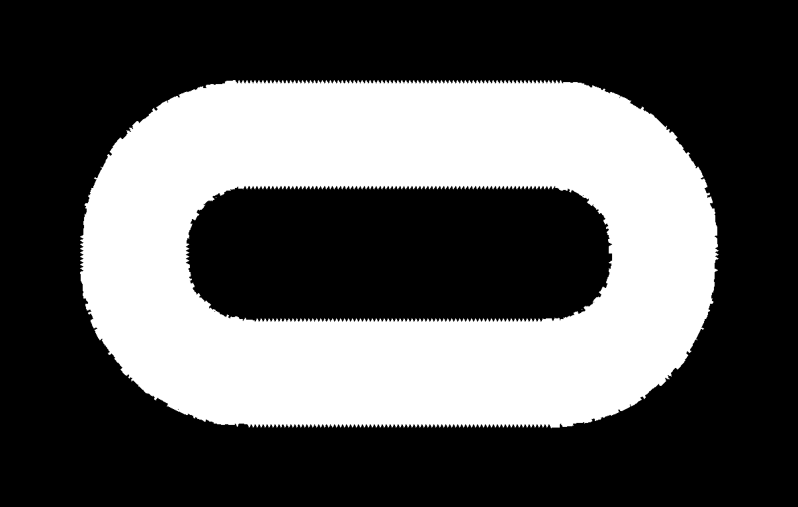
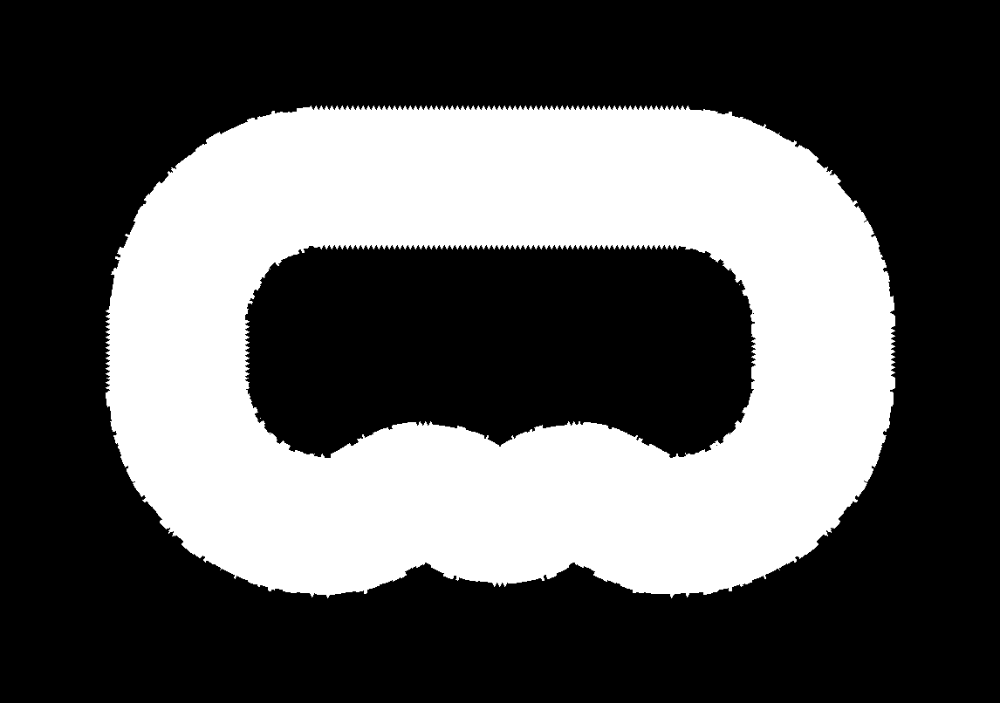
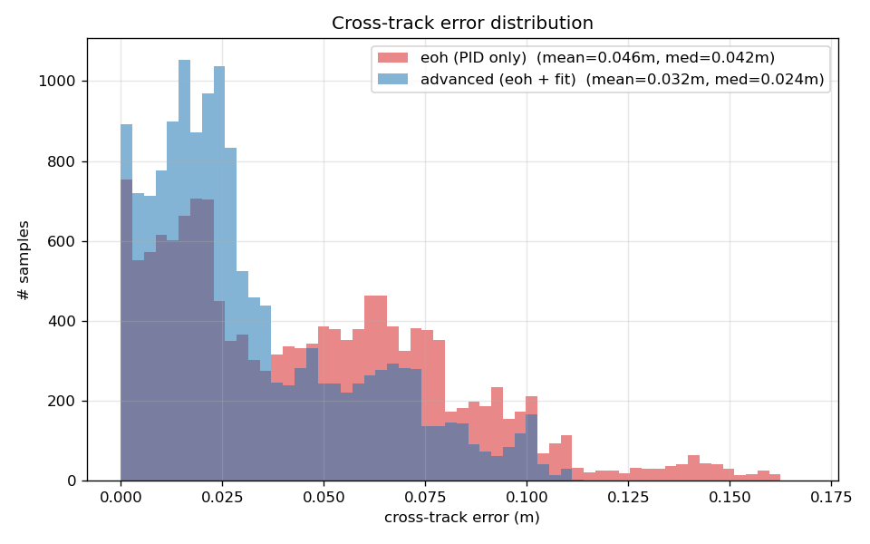
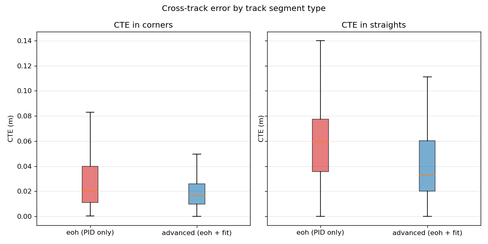
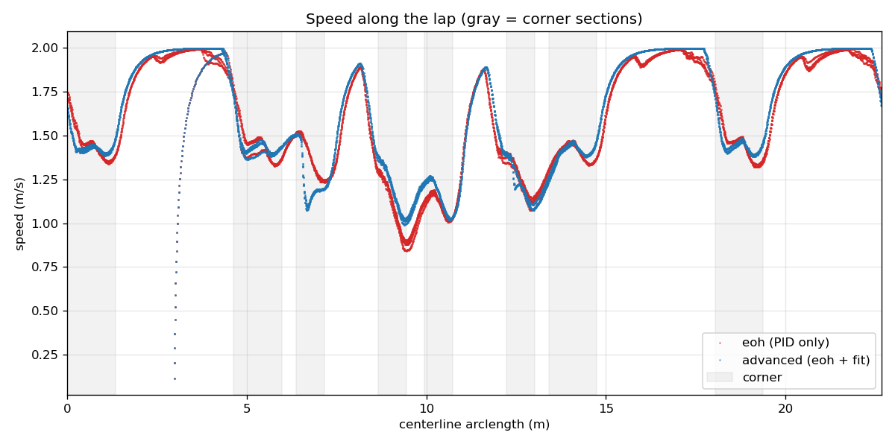
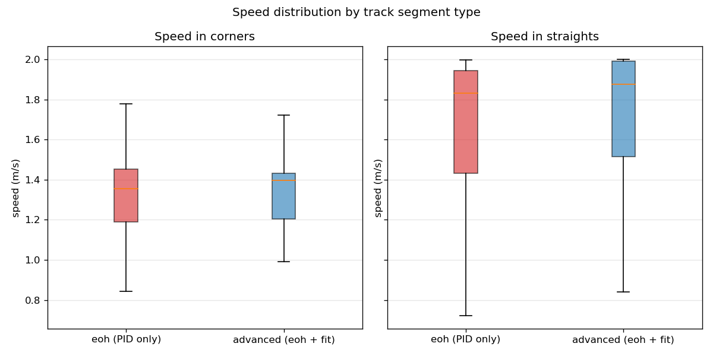
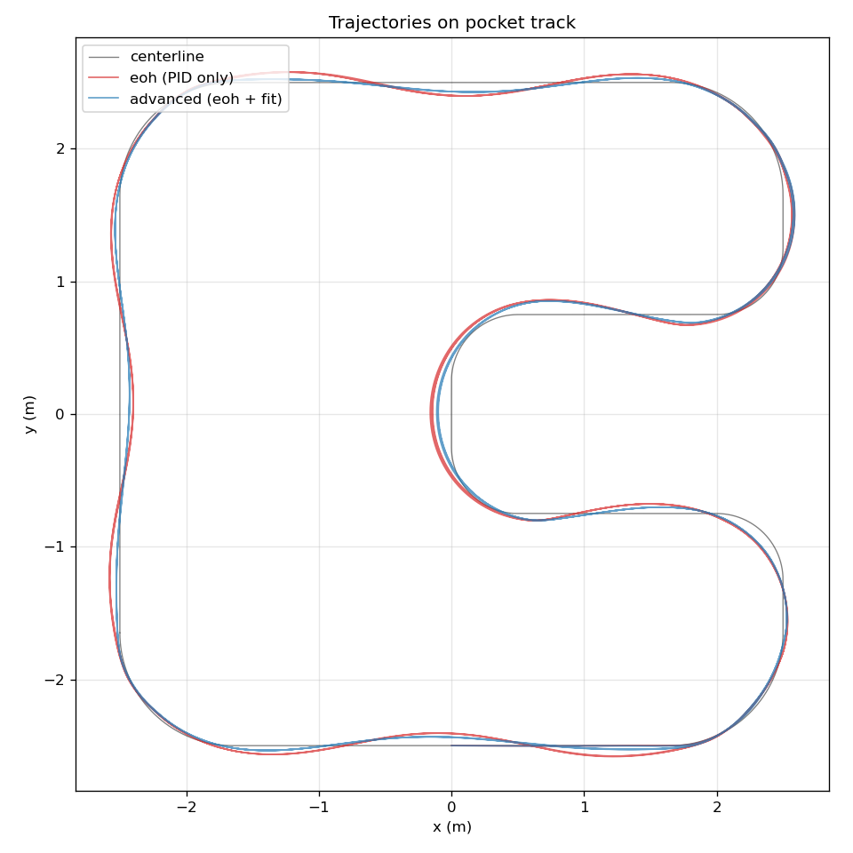
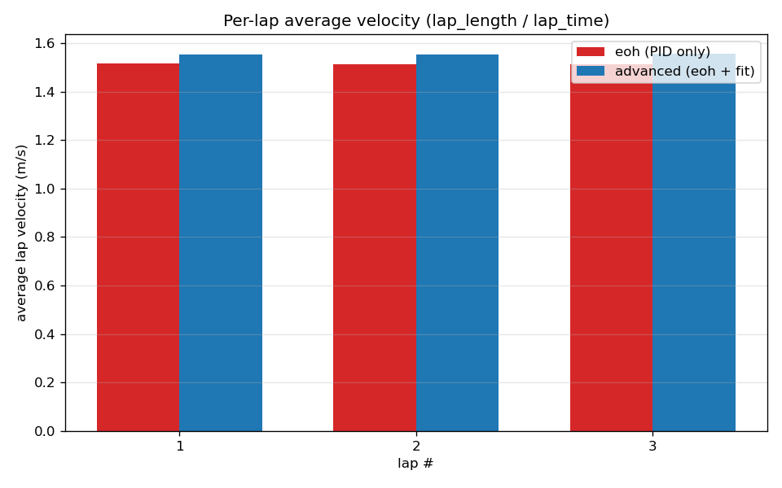

::: {.hero-section}

# Ten Tenths {.title}

::: {.subtitle}
A LiDAR autonomy stack for the F1Tenth platform. A Wall-Balance PID provides the always-on safety floor. A health-gated quadratic wall fit adds a bounded heading feedforward and a curvature-based speed cap on top.
:::

::: {.author-list}

[**Arjun Chainani**](https://github.com/arjunchainani),
[**Sam Lee**](https://github.com/samlee-dev),
[**Suryansh Singh**](https://github.com/)

:::

::: {.affiliation-list}

University of Illinois Urbana-Champaign · ECE 484 · Spring 2026 · Midpoint Checkpoint (Apr 21)

:::

::: {.button-row}

[[ Video]{.btn-text}](#video){.btn .btn-primary}
[[ Results]{.btn-text}](#results){.btn .btn-primary}
[[ Code]{.btn-text}](https://github.com/arjunchainani/ece-484-f1tenth){.btn .btn-primary}

:::

:::


<!-- ============================================================ -->
<!-- TEASER: System Architecture Block Diagram                    -->
<!-- ============================================================ -->

::: {.section-container}

::: {.hero-teaser}

```{=html}
<svg viewBox="0 0 960 380" xmlns="http://www.w3.org/2000/svg" width="100%"
     style="max-width:960px;display:block;margin:0 auto;border-radius:10px;box-shadow:0 4px 24px rgba(0,0,0,0.08)">
  <defs>
    <marker id="arr" markerWidth="8" markerHeight="6" refX="8" refY="3" orient="auto">
      <polygon points="0 0, 8 3, 0 6" fill="#8fa3c0"/>
    </marker>
    <marker id="arr-blue" markerWidth="8" markerHeight="6" refX="8" refY="3" orient="auto">
      <polygon points="0 0, 8 3, 0 6" fill="#00d4ff"/>
    </marker>
    <marker id="arr-orange" markerWidth="8" markerHeight="6" refX="8" refY="3" orient="auto">
      <polygon points="0 0, 8 3, 0 6" fill="#ff6b35"/>
    </marker>
  </defs>

  <!-- background -->
  <rect width="960" height="380" fill="#0a0e17" rx="10"/>

  <!-- SENSING column -->
  <rect x="10" y="10" width="170" height="360" rx="6" fill="#141b28" stroke="#2a3a55" stroke-width="1"/>
  <text x="95" y="35" text-anchor="middle" font-family="monospace" font-size="9" fill="#5a7090" letter-spacing="2">SENSING</text>
  <rect x="25" y="70" width="140" height="60" rx="4" fill="#1a2235" stroke="#2563eb" stroke-width="1.5"/>
  <text x="95" y="92" text-anchor="middle" font-family="sans-serif" font-size="11" fill="#e8edf5">2D LiDAR Scan</text>
  <text x="95" y="108" text-anchor="middle" font-family="monospace" font-size="9" fill="#8fa3c0">/ego_racecar/scan</text>
  <text x="95" y="122" text-anchor="middle" font-family="monospace" font-size="9" fill="#8fa3c0">1080 rays · ~250 Hz</text>
  <rect x="25" y="160" width="140" height="60" rx="4" fill="#1a2235" stroke="#2563eb" stroke-width="1.5"/>
  <text x="95" y="182" text-anchor="middle" font-family="sans-serif" font-size="11" fill="#e8edf5">Odometry</text>
  <text x="95" y="198" text-anchor="middle" font-family="monospace" font-size="9" fill="#8fa3c0">/ego_racecar/odom</text>
  <text x="95" y="212" text-anchor="middle" font-family="monospace" font-size="9" fill="#8fa3c0">(for analysis only)</text>
  <rect x="25" y="250" width="140" height="60" rx="4" fill="#1a2235" stroke="#2563eb" stroke-width="1.5"/>
  <text x="95" y="272" text-anchor="middle" font-family="sans-serif" font-size="11" fill="#e8edf5">Joy Enable</text>
  <text x="95" y="288" text-anchor="middle" font-family="monospace" font-size="9" fill="#8fa3c0">/joy · Y button</text>

  <!-- INNER LOOP column -->
  <rect x="196" y="10" width="180" height="360" rx="6" fill="#141b28" stroke="#2a3a55" stroke-width="1"/>
  <text x="286" y="35" text-anchor="middle" font-family="monospace" font-size="9" fill="#00d4ff" letter-spacing="2">WALL-BALANCE PID</text>
  <rect x="211" y="48" width="150" height="50" rx="4" fill="#1a2235" stroke="#00d4ff" stroke-width="1.5"/>
  <text x="286" y="68" text-anchor="middle" font-family="sans-serif" font-size="11" fill="#e8edf5">Wall Windows</text>
  <text x="286" y="84" text-anchor="middle" font-family="monospace" font-size="9" fill="#00d4ff">±60° ± 5 rays</text>
  <rect x="211" y="110" width="150" height="50" rx="4" fill="#1a2235" stroke="#00d4ff" stroke-width="1.5"/>
  <text x="286" y="130" text-anchor="middle" font-family="sans-serif" font-size="11" fill="#e8edf5">PID on d_L − d_R</text>
  <text x="286" y="146" text-anchor="middle" font-family="monospace" font-size="9" fill="#00d4ff">Kp=0.6 Ki=.005 Kd=0.2</text>
  <rect x="211" y="172" width="150" height="50" rx="4" fill="#1a2235" stroke="#00d4ff" stroke-width="1.5"/>
  <text x="286" y="192" text-anchor="middle" font-family="sans-serif" font-size="11" fill="#e8edf5">Forward Clearance</text>
  <text x="286" y="208" text-anchor="middle" font-family="monospace" font-size="9" fill="#00d4ff">v = clip(d_f · 2, 0, v_max)</text>
  <rect x="211" y="234" width="150" height="50" rx="4" fill="#1a2235" stroke="#00d4ff" stroke-width="2"/>
  <text x="286" y="254" text-anchor="middle" font-family="sans-serif" font-size="11" font-weight="600" fill="#00d4ff">steer_wb, v_wb</text>
  <text x="286" y="270" text-anchor="middle" font-family="monospace" font-size="9" fill="#8fa3c0">safety floor</text>

  <line x1="180" y1="100" x2="211" y2="72" stroke="#2563eb" stroke-width="1.2" marker-end="url(#arr)"/>
  <line x1="286" y1="98" x2="286" y2="110" stroke="#00d4ff" stroke-width="1.5" marker-end="url(#arr-blue)"/>
  <line x1="286" y1="160" x2="286" y2="172" stroke="#00d4ff" stroke-width="1.5" marker-end="url(#arr-blue)"/>
  <line x1="286" y1="222" x2="286" y2="234" stroke="#00d4ff" stroke-width="1.5" marker-end="url(#arr-blue)"/>

  <!-- ADVANCED AUG column -->
  <rect x="392" y="10" width="180" height="360" rx="6" fill="#141b28" stroke="#2a3a55" stroke-width="1"/>
  <text x="482" y="35" text-anchor="middle" font-family="monospace" font-size="9" fill="#7fff6b" letter-spacing="2">ADVANCED AUGMENTATION</text>
  <rect x="407" y="48" width="150" height="50" rx="4" fill="#1a2235" stroke="#7fff6b" stroke-width="1.5"/>
  <text x="482" y="68" text-anchor="middle" font-family="sans-serif" font-size="11" fill="#e8edf5">Wide Sectors</text>
  <text x="482" y="84" text-anchor="middle" font-family="monospace" font-size="9" fill="#7fff6b">±30° .. ±120°</text>
  <rect x="407" y="110" width="150" height="50" rx="4" fill="#1a2235" stroke="#7fff6b" stroke-width="1.5"/>
  <text x="482" y="130" text-anchor="middle" font-family="sans-serif" font-size="11" fill="#e8edf5">Quadratic Fit / Wall</text>
  <text x="482" y="146" text-anchor="middle" font-family="monospace" font-size="9" fill="#7fff6b">y = ax² + bx + c · MAD</text>
  <rect x="407" y="172" width="150" height="50" rx="4" fill="#1a2235" stroke="#7fff6b" stroke-width="2"/>
  <text x="482" y="192" text-anchor="middle" font-family="sans-serif" font-size="11" font-weight="600" fill="#7fff6b">Health Window K=3</text>
  <text x="482" y="208" text-anchor="middle" font-family="monospace" font-size="9" fill="#7fff6b">sign(b) consistent · σ(b) low</text>
  <rect x="407" y="234" width="150" height="50" rx="4" fill="#1a2235" stroke="#7fff6b" stroke-width="1.5"/>
  <text x="482" y="254" text-anchor="middle" font-family="sans-serif" font-size="11" fill="#e8edf5">Heading FF</text>
  <text x="482" y="270" text-anchor="middle" font-family="monospace" font-size="9" fill="#7fff6b">ff = k · ½(b_L + b_R)</text>
  <rect x="407" y="296" width="150" height="50" rx="4" fill="#1a2235" stroke="#7fff6b" stroke-width="1.5"/>
  <text x="482" y="316" text-anchor="middle" font-family="sans-serif" font-size="11" fill="#e8edf5">Curvature Cap</text>
  <text x="482" y="332" text-anchor="middle" font-family="monospace" font-size="9" fill="#7fff6b">v_curv = √(a_lat / |κ|)</text>

  <line x1="180" y1="100" x2="407" y2="72" stroke="#2563eb" stroke-width="1" stroke-dasharray="4,3" marker-end="url(#arr)"/>
  <line x1="482" y1="98" x2="482" y2="110" stroke="#7fff6b" stroke-width="1.5" marker-end="url(#arr)"/>
  <line x1="482" y1="160" x2="482" y2="172" stroke="#7fff6b" stroke-width="1.5" marker-end="url(#arr)"/>
  <line x1="482" y1="222" x2="482" y2="234" stroke="#7fff6b" stroke-width="1.5" marker-end="url(#arr)"/>
  <line x1="482" y1="284" x2="482" y2="296" stroke="#7fff6b" stroke-width="1.5" marker-end="url(#arr)"/>

  <!-- COMBINER column -->
  <rect x="588" y="10" width="170" height="360" rx="6" fill="#141b28" stroke="#2a3a55" stroke-width="1"/>
  <text x="673" y="35" text-anchor="middle" font-family="monospace" font-size="9" fill="#ffd166" letter-spacing="2">BOUNDED COMBINER</text>
  <rect x="603" y="100" width="140" height="60" rx="4" fill="#1a2235" stroke="#ffd166" stroke-width="2"/>
  <text x="673" y="124" text-anchor="middle" font-family="sans-serif" font-size="11" font-weight="600" fill="#ffd166">clip(steer_wb + ff)</text>
  <text x="673" y="142" text-anchor="middle" font-family="monospace" font-size="9" fill="#ffd166">|ff| ≤ 0.12 rad</text>
  <text x="673" y="154" text-anchor="middle" font-family="monospace" font-size="9" fill="#8fa3c0">|δ| ≤ 0.4 rad</text>
  <rect x="603" y="200" width="140" height="60" rx="4" fill="#1a2235" stroke="#ffd166" stroke-width="2"/>
  <text x="673" y="224" text-anchor="middle" font-family="sans-serif" font-size="11" font-weight="600" fill="#ffd166">min(v_wb, v_curv)</text>
  <text x="673" y="242" text-anchor="middle" font-family="monospace" font-size="9" fill="#ffd166">cap only · never raise</text>

  <line x1="361" y1="260" x2="603" y2="130" stroke="#00d4ff" stroke-width="1.5" marker-end="url(#arr-blue)"/>
  <line x1="361" y1="260" x2="603" y2="225" stroke="#00d4ff" stroke-width="1.5" marker-end="url(#arr-blue)"/>
  <line x1="557" y1="260" x2="603" y2="135" stroke="#7fff6b" stroke-width="1.2" marker-end="url(#arr)"/>
  <line x1="557" y1="320" x2="603" y2="230" stroke="#7fff6b" stroke-width="1.2" marker-end="url(#arr)"/>

  <!-- OUTPUT column -->
  <rect x="772" y="10" width="178" height="360" rx="6" fill="#141b28" stroke="#2a3a55" stroke-width="1"/>
  <text x="861" y="35" text-anchor="middle" font-family="monospace" font-size="9" fill="#ff6b35" letter-spacing="2">ACTUATION</text>
  <rect x="787" y="100" width="148" height="60" rx="4" fill="#1a2235" stroke="#ff6b35" stroke-width="2"/>
  <text x="861" y="124" text-anchor="middle" font-family="sans-serif" font-size="11" font-weight="600" fill="#ff6b35">AckermannDrive</text>
  <text x="861" y="142" text-anchor="middle" font-family="monospace" font-size="9" fill="#ff6b35">/ego_racecar/drive</text>
  <text x="861" y="154" text-anchor="middle" font-family="monospace" font-size="9" fill="#8fa3c0">steer + speed</text>
  <rect x="787" y="200" width="148" height="60" rx="4" fill="#1f2940" stroke="#ff6b35" stroke-width="1.5"/>
  <text x="861" y="224" text-anchor="middle" font-family="sans-serif" font-size="11" font-weight="600" fill="#e8edf5">F1Tenth Plant</text>
  <text x="861" y="242" text-anchor="middle" font-family="monospace" font-size="9" fill="#8fa3c0">sim · or real car</text>

  <line x1="743" y1="130" x2="787" y2="130" stroke="#ffd166" stroke-width="1.5" marker-end="url(#arr)"/>
  <line x1="743" y1="230" x2="787" y2="230" stroke="#ffd166" stroke-width="1.5" marker-end="url(#arr)"/>
  <line x1="861" y1="160" x2="861" y2="200" stroke="#ff6b35" stroke-width="1.5" marker-end="url(#arr-orange)"/>
</svg>
```

*System architecture. The LiDAR scan feeds the Wall-Balance PID inner loop (always on) and the wide-sector wall fits (gated by a multi-frame health check). The combiner clips the heading feedforward to ±0.12 rad and applies the curvature speed cap only downward. The inner loop remains the safety floor.*

:::

:::


<!-- ============================================================ -->
<!-- PROBLEM STATEMENT                                            -->
<!-- ============================================================ -->

::: {.section-container}

## Problem Statement {.section-title}

::: {.abstract-text}

**F1Tenth** is a 1:10-scale autonomous racing platform carrying a 2D LiDAR, a stereo camera, a 9-DoF IMU, wheelspeed sensors, and an onboard NVIDIA Jetson. Races are run on taped floor-line tracks.

The midpoint milestone targets **LiDAR lane-following**: given only a `LaserScan` stream and no prior map, drive laps around an arbitrary closed track while staying inside the lane.

The baseline is a **Wall-Balance PID**. Two angular windows are sampled at ±60° in the LiDAR frame, each averaged to a single mean range `d_L` and `d_R`. A PID drives the asymmetry `d_L − d_R` to zero. Speed is set by the minimum range in a ±10° forward cone. No map, no fit, no model: two wall distances and a clearance scalar. This baseline drives the real car without collisions and serves as the safety floor.

The project investigates whether adding fit-based features (quadratic wall curvature, heading estimate) on top of the Wall-Balance PID can improve centerline tracking without reducing its robustness. The remainder of this page quantifies where the augmentation helps, where it is conservative, and what will change next.

:::

:::


<!-- ============================================================ -->
<!-- VIDEOS                                                       -->
<!-- ============================================================ -->

::: {.section-container}

## Video {#video .section-title}

::: {.content-text}

Each clip is annotated. The **sim annotation** shows the RViz visualization of the wall windows, fitted quadratics, and the synthesized centerline overlaid on the f1tenth_gym simulator. The **ROSBAG annotations** replay two real-vehicle LiDAR logs through the same visualization pipeline. The **physical annotation** is footage of the F1Tenth chassis running the stack on hardware.

:::

::: {.video-container}
**Simulator run.** RViz overlay showing the left and right wall windows (green and red), per-wall quadratic fits, and the midline used for the heading feedforward.

<iframe width="560" height="315" src="https://www.youtube.com/embed/TQtE2rdltpQ?si=eIpIlK9I2D63fyfT" title="Ten Tenths: sim annotation" frameborder="0" allow="accelerometer; autoplay; clipboard-write; encrypted-media; gyroscope; picture-in-picture; web-share" referrerpolicy="strict-origin-when-cross-origin" allowfullscreen></iframe>
:::

::: {.video-container}
**LiDAR ROSBAG #1.** Offline replay of a real-car LiDAR rosbag, processed by the same perception path used live. The ±60° wall-balance windows and the wide fit sectors are both drawn.

<iframe width="560" height="315" src="https://www.youtube.com/embed/QbozmKPfpeE?si=uL4U_tl9wkPfG3G5" title="Ten Tenths: LiDAR ROSBAG annotation 1" frameborder="0" allow="accelerometer; autoplay; clipboard-write; encrypted-media; gyroscope; picture-in-picture; web-share" referrerpolicy="strict-origin-when-cross-origin" allowfullscreen></iframe>
:::

::: {.video-container}
**LiDAR ROSBAG #2.** A second bag, captured on a different corner configuration. Health-window gating is visible: the fit curve disappears for a few frames at corner entry, which is when the heading feedforward falls back to 0.

<iframe width="560" height="315" src="https://www.youtube.com/embed/InFsui8X698?si=oCQDBRA18LK3450c" title="Ten Tenths: LiDAR ROSBAG annotation 2" frameborder="0" allow="accelerometer; autoplay; clipboard-write; encrypted-media; gyroscope; picture-in-picture; web-share" referrerpolicy="strict-origin-when-cross-origin" allowfullscreen></iframe>
:::

::: {.video-container}
**Physical vehicle.** The F1Tenth running the stack on the CSL Studio test track.

<iframe width="560" height="315" src="https://www.youtube.com/embed/9cvgfgG8jbA?si=axeF-07p6Rq8JgcD" title="Ten Tenths: physical vehicle annotation" frameborder="0" allow="accelerometer; autoplay; clipboard-write; encrypted-media; gyroscope; picture-in-picture; web-share" referrerpolicy="strict-origin-when-cross-origin" allowfullscreen></iframe>
:::

:::


<!-- ============================================================ -->
<!-- CONTROLLER                                                   -->
<!-- ============================================================ -->

::: {.section-container}

## Controller Architecture {.section-title}

::: {.content-text}

The autonomy runs as a single ROS 2 node, `lane_follower_node`. Each incoming LiDAR scan is processed through two parallel paths whose outputs are combined by a bounded mixer.

### 1. Wall-Balance PID inner loop (safety floor)

Two 11-ray windows are taken at ±60°; the **steering error** is the mean-range difference `d_L − d_R` fed through a PID with `Kp=0.6, Ki=0.005, Kd=0.2` and an integral clamp of 20. A ±10° forward cone supplies the minimum clearance used as **speed command** `v = clip(d_front · 2, 0, v_max)`.

```python
d_left  = mean(ranges[left_window])
d_right = mean(ranges[right_window])
error   = d_left - d_right
steer   = Kp*error + Ki*∫error + Kd*Δerror   # clamped to ±0.4 rad
speed   = clip(min(front_cone) * 2.0, 0, v_max)
```

This loop is always on. Setting `enable_advanced: false` reverts to byte-identical Wall-Balance behavior. The augmentation cannot take the controller below this floor.

### 2. Fit-based augmentation (bounded, gated)

Wide angular sectors (±30° to ±120°) on each side are collected into point clouds in vehicle frame. An MAD-filtered quadratic `y = ax² + bx + c` is fit per wall. The fit's **linear term `b`** is the local wall slope at the car, used as a heading signal.

The fit is not trusted until a **health window** of K=3 consecutive scans has:

- produced a valid fit on that side,
- agreed on `sign(b)` (prevents corner-entry flips),
- kept `σ(b) < b_stability_thresh`.

When both sides are healthy, a **heading feedforward** `ff = k · ½(b_L + b_R)` is clipped to ±0.12 rad (~30% of max steer) and added to the PID output. A **curvature-based speed cap** `v_curv = √(a_lat / |κ|)` is derived from the fit's quadratic coefficients and applied as `min(v_wb, v_curv)`. The cap can only lower the Wall-Balance speed, never raise it.

### 3. Bounded combiner

```python
steer_cmd = clip(steer_wb + ff,              -0.4, 0.4)  # inner-loop clip
speed_cmd = min(speed_wb, v_curv)                        # cap-only
```

An optional first-order EMA on the combined commands is wired up but disabled (`steer_tau = speed_tau = 0`). At 250 Hz scan rate the raw signal is already smooth.

:::

:::


<!-- ============================================================ -->
<!-- WHY THE HEALTH WINDOW                                        -->
<!-- ============================================================ -->

::: {.section-container}

## Design Decision: the Health Window {.section-title}

::: {.content-text}

The earliest version of the fit-based controller (still in the tree as `lane_follower_node_quadfit.py.bak`) fed the quadratic coefficients directly into the steer command, with no PID fallback and no sanity gating. It failed on the tight 5×6 m circuit. At corner entry, the LiDAR briefly sees the outside wall of the next corner, which flips the sign of `b` for several scans. The controller oversteers and the car clips the apex.

The health window is the direct fix. It does three things:

1. **Raw sanity.** MAD outlier reject on the point cloud; reject fits with `|a| > 20` or `|b| > 10`.
2. **Multi-frame agreement.** Require the last K=3 fits to all be valid and agree on `sign(b)`.
3. **Stability.** Require `σ(b)` across the window to be below `b_stability_thresh = 1.0`.

If any of those fail, `ff = 0` and `v_curv = ∞` on that frame. The advanced layer steps aside, and the Wall-Balance PID drives alone.

The result is a bounded perturbation: the worst case of the advanced layer is identical to Wall-Balance. Across 2 × 60 s of simulator driving over all four test tracks, zero collisions occurred in either condition.

:::

:::


<!-- ============================================================ -->
<!-- TEST TRACKS                                                  -->
<!-- ============================================================ -->

::: {.section-container}

## Test Tracks {.section-title}

::: {.content-text}

Four procedurally-generated maps cover a range of corner geometries. Each has 80 cm lane width, 3 cm right-angle sawtooth wall detail, and fillet radii sized against the car's 0.74 m minimum turn radius. Map-generation scripts are under `src/f1tenth_simulator/f1tenth_gym_ros/maps/`.

:::

::: {.comparison-grid}

::: {.comparison-item}


**circuit.** A 5×6 m closed loop with fillet corners at the minimum turn radius. Shakedown track.
:::

::: {.comparison-item}


**hairpin.** Paperclip layout. Two 180° U-turns (r=0.85 m) joined by 4 m parallel straights. Exercises full ±0.4 rad steering.
:::

::: {.comparison-item}


**snake.** A 5-bend serpentine (r=0.4 m, below the minimum turn radius) plus a rectangular wrap. First map to exercise the left and right alternation logic.
:::

::: {.comparison-item}


**pocket.** C-shape with a 2.5×1.5 m notch on the right side. Notch-corner radii are 0.5 m. Used as the study map below.
:::

:::

:::


<!-- ============================================================ -->
<!-- RESULTS: CROSS-COMPARISON STUDY                              -->
<!-- ============================================================ -->

::: {.section-container}

## Results: Wall-Balance vs Advanced {#results .section-title}

::: {.content-text}

Both controllers were run back-to-back on the **pocket** track (centerline length 22.68 m, 37% classified as corner). Each condition was given 60 s of wall-clock driving at `max_speed = 1.5 m/s`. Cross-track error (CTE) is the Euclidean distance from each odom sample to the nearest centerline point, evaluated against an 11336-sample KDTree reconstruction.

**Runs per condition:** 1 continuous 60 s session, 3 full laps each · **Collisions:** 0 · **Reproduce:** `study/run_comparison.sh 60 && python3 study/analyze.py`

### Cross-track error

| metric | wall-balance (m) | advanced (m) | Δ (adv − wb) | % change |
|--------|---------|--------------|---------------|----------|
| mean | 0.046 | 0.032 | −0.014 | **−30 %** |
| median | 0.042 | 0.024 | −0.017 | −40 % |
| p95 | 0.105 | 0.084 | −0.021 | **−20 %** |
| max | 0.160 | 0.111 | −0.049 | −31 % |
| mean (corners only) | 0.029 | 0.022 | −0.007 | −24 % |
| mean (straights only) | 0.059 | 0.040 | −0.019 | **−32 %** |

The CTE gain is concentrated on the straights. The bounded heading feedforward pulls the car toward the geometric centerline on long straights, where the symmetric `d_L − d_R` signal would otherwise tolerate any laterally-offset path.

::: {.comparison-grid}

::: {.comparison-item}


Distribution of cross-track error per odom sample. Advanced shifts the distribution toward zero.
:::

::: {.comparison-item}


CTE split by corner and straight samples. Both improve; the straights improve more.
:::

:::

### Speed & lap time

| metric | wall-balance (m/s) | advanced (m/s) | Δ |
|--------|-----------|----------------|---|
| mean speed | 1.523 | 1.561 | +0.038 |
| mean in corners | 1.324 | 1.331 | +0.007 |
| mean in straights | 1.677 | 1.735 | +0.057 |
| min in corners | 0.843 | 0.991 | **+0.148** |
| max | 1.996 | 2.000 | +0.003 |

| condition    | lap 1 | lap 2 | lap 3 | lap time (mean ± std) | avg v |
|--------------|-------|-------|-------|------------------------|-------|
| wall-balance | 14.95 s | 15.00 s | 15.01 s | **15.00 ± 0.03 s** | 1.513 m/s |
| advanced     | 14.60 s | 14.61 s | 14.56 s | **14.59 ± 0.03 s** | 1.555 m/s |

Advanced is 0.4 s faster per lap (−2.7 %). Lap-to-lap variance is low in both conditions (std ≈ 30 ms).

::: {.comparison-grid}

::: {.comparison-item}


Speed trace over a lap's arclength. Advanced holds the speed floor higher through the notch.
:::

::: {.comparison-item}


Mean speed in corner and straight segments.
:::

:::

### Trajectories and per-lap velocity

::: {.comparison-grid}

::: {.comparison-item}


Driven trajectories overlaid on the centerline. The advanced path stays closer to the centerline on straights and cuts less into the notch-corner apices.
:::

::: {.comparison-item}


Per-lap average velocity across 3 full laps, each condition.
:::

:::

### Observations

1. **Centerline tracking improves.** Mean CTE drops by ~30 %, p95 by ~20 %. The bounded heading feedforward is the dominant contributor, and its effect is on straights rather than corners.
2. **The curvature speed cap is conservative.** The notch radii are 0.5 m, which drives `v_curv ≈ √(a_lat / |κ|)` toward 1 m/s. The Wall-Balance baseline cleared the same corners at ~1.3 m/s using forward-clearance speed alone. The cap accounts for most of the remaining corner-speed gap. Raising `lateral_accel_limit` or relaxing the cap to `min(v_wb, α · v_curv)` with `α > 1` would recover this.
3. **No safety regression.** Zero collisions in either condition. Lap-time variance is unchanged. The health-gated bounded design provides improvements when trusted and passthrough when not.

:::

:::


<!-- ============================================================ -->
<!-- MILESTONE STATUS                                             -->
<!-- ============================================================ -->

::: {.section-container}

## Milestone Status {.section-title}

::: {.content-text}

ECE 484 measures F1Tenth teams against **Milestone 2 (software) complete** and **Milestones 3–4 (hardware) in progress** at the midpoint checkpoint.

:::

```{=html}
<div style="max-width:700px;margin:1.5rem auto 0;">
  <div style="margin-bottom:14px;">
    <div style="display:flex;justify-content:space-between;font-size:0.92rem;color:#333;margin-bottom:4px;"><span>Simulator + ROS 2 bridge set up</span><span>100%</span></div>
    <div style="height:7px;background:#e0e0e0;border-radius:3px;overflow:hidden;"><div style="height:100%;width:100%;background:#4a6cf7;border-radius:3px;"></div></div>
  </div>
  <div style="margin-bottom:14px;">
    <div style="display:flex;justify-content:space-between;font-size:0.92rem;color:#333;margin-bottom:4px;"><span>Wall-Balance PID in simulation</span><span>100%</span></div>
    <div style="height:7px;background:#e0e0e0;border-radius:3px;overflow:hidden;"><div style="height:100%;width:100%;background:#4a6cf7;border-radius:3px;"></div></div>
  </div>
  <div style="margin-bottom:14px;">
    <div style="display:flex;justify-content:space-between;font-size:0.92rem;color:#333;margin-bottom:4px;"><span>Quadratic fit + health-gated augmentation</span><span>100%</span></div>
    <div style="height:7px;background:#e0e0e0;border-radius:3px;overflow:hidden;"><div style="height:100%;width:100%;background:#4a6cf7;border-radius:3px;"></div></div>
  </div>
  <div style="margin-bottom:14px;">
    <div style="display:flex;justify-content:space-between;font-size:0.92rem;color:#333;margin-bottom:4px;"><span>Procedural test-map suite (4 tracks)</span><span>100%</span></div>
    <div style="height:7px;background:#e0e0e0;border-radius:3px;overflow:hidden;"><div style="height:100%;width:100%;background:#4a6cf7;border-radius:3px;"></div></div>
  </div>
  <div style="margin-bottom:14px;">
    <div style="display:flex;justify-content:space-between;font-size:0.92rem;color:#333;margin-bottom:4px;"><span>Quantitative cross-comparison study</span><span>100%</span></div>
    <div style="height:7px;background:#e0e0e0;border-radius:3px;overflow:hidden;"><div style="height:100%;width:100%;background:#4a6cf7;border-radius:3px;"></div></div>
  </div>
  <div style="margin-bottom:14px;">
    <div style="display:flex;justify-content:space-between;font-size:0.92rem;color:#333;margin-bottom:4px;"><span>Hardware integration &amp; lane-follow on-car</span><span>55%</span></div>
    <div style="height:7px;background:#e0e0e0;border-radius:3px;overflow:hidden;"><div style="height:100%;width:55%;background:#4a6cf7;border-radius:3px;"></div></div>
  </div>
  <div style="margin-bottom:14px;">
    <div style="display:flex;justify-content:space-between;font-size:0.92rem;color:#333;margin-bottom:4px;"><span>Robustness testing (multi-track hardware)</span><span>20%</span></div>
    <div style="height:7px;background:#e0e0e0;border-radius:3px;overflow:hidden;"><div style="height:100%;width:20%;background:#4a6cf7;border-radius:3px;"></div></div>
  </div>
</div>
```

:::


<!-- ============================================================ -->
<!-- LESSONS                                                      -->
<!-- ============================================================ -->

::: {.section-container}

## Lessons Learned {.section-title}

::: {.content-text}

**Extend, do not replace.** The pure-quadfit first pass was worse than the Wall-Balance baseline on the corners Wall-Balance was tuned for. Keeping Wall-Balance as an always-on inner loop and making the fit layer a bounded perturbation preserved smoother straights and corner-entry prediction without losing the safety floor.

**Multi-frame gating matters more than sanity checks.** Per-frame sanity (MAD reject, coefficient bounds) removed ~10 % of bad fits. The multi-frame gates (sign-of-`b` consistency, σ-of-`b` stability) removed the catastrophic cases: the corner-entry b-flips that caused crashes. The cost is a K-scan delay on the augmentation, 12 ms at 250 Hz, which does not affect control.

**Define the metric before tuning.** Early tuning was visual ("looks smoother"). Once `study/analyze.py` existed (CTE mean and p95, corner and straight split, per-lap time), tuning `lateral_accel_limit` and `heading_gain` took one evening rather than a week. The analysis also showed that the curvature cap was over-binding on the notch rather than simply slow.

**Procedurally-generated maps catch issues early.** The hairpin map exposed saturation of steering authority on tight U-turns. The snake map surfaced an alternation bug in wall assignment. The pocket map's notch was designed so the curvature cap would bind. Each map took roughly 2 hours of Python to generate.

:::

:::


<!-- ============================================================ -->
<!-- NEXT STEPS                                                   -->
<!-- ============================================================ -->

::: {.section-container}

## Next Steps {.section-title}

::: {.content-text}

**Hardware bring-up (weeks of Apr 21 to May 2).** Port the tuned simulator parameters to the physical F1Tenth chassis and validate on the CSL Studio test track. The hardware drive and scan topics match the sim, so the controller code should transfer unmodified. The remaining tuning work is on `speed_gain` and `max_speed` under real-world tire friction.

**Relax the curvature cap.** The pocket study showed the cap is ~30 % too conservative. Options: (a) raise `lateral_accel_limit` from 4.5 m/s² (its current value; the study run used 2.0) once real-car tire-grip data is available; (b) gate the cap to apply only when `|κ|` has been stable for a window, mirroring the heading-feedforward gate; (c) soften the cap to `min(v_wb, α · v_curv)` with `α ≈ 1.2`.

**Enable the EMA smoother on hardware.** `steer_tau` and `speed_tau` are wired up but disabled (tau=0) in simulation because the 250 Hz scan rate is already smooth. On hardware at a 40 to 100 Hz effective rate with motor-controller latency, a small `tau ≈ 50 ms` should reduce command chatter without adding perceptible lag.

**Expand the study.** Add the circuit, snake, and hairpin tracks to `run_comparison.sh` and report a full `(track × controller × param-sweep)` grid. Capture corner-entry LiDAR rosbags to enable deterministic offline replay of health-window behavior.

**Incorporate camera lane detection as a second input.** The IPM plus polynomial lane pipeline (not in the midpoint scope) is under development in parallel. The bounded-combiner pattern generalizes: the camera lane estimate would plug in as a third input that contributes only when healthy.

:::

:::


<!-- ============================================================ -->
<!-- TEAM                                                         -->
<!-- ============================================================ -->

::: {.section-container}

## Team & Timeline {.section-title}

::: {.content-text}

**Arjun Chainani.** *Controls and integration.* Wall-Balance PID implementation in ROS 2, quadratic fit and health-window design, parameter tuning across tracks.

**Sam Lee.** *Simulation and analysis.* Procedural map generation, comparison-study harness, analysis pipeline (CTE, speed, lap), site.

**Suryansh Singh.** *Hardware and perception.* CSL Studio bring-up, ROSBAG collection and annotation, camera-lane pipeline (post-midpoint).

:::

::: {.content-text}

| Week | Period | Milestone | Status |
|------|--------|-----------|--------|
| 1–2  | Jan 2026 | Research, architecture, simulator stand-up | ✅ Done |
| 3–4  | Jan–Feb 2026 | Wall-Balance PID + ROS 2 package scaffolding | ✅ Done |
| 5–6  | Feb–Mar 2026 | Procedural maps, quadfit prototype (failed pass) | ✅ Done |
| 7    | Mar 2026 | Health-gated advanced controller | ✅ Done |
| 8    | Apr 2026 | Cross-comparison study + writeup | ✅ Done (Apr 21) |
| 9–10 | Apr–May 2026 | Hardware deployment + on-car tuning | 🔄 In progress |
| 11–12 | May 2026 | Multi-track hardware robustness + final report | 📋 Planned |

:::

:::


<!-- ============================================================ -->
<!-- REPRODUCE                                                    -->
<!-- ============================================================ -->

::: {.section-container}

## Reproduce {.section-title}

::: {.content-text}

The repository is at **[github.com/arjunchainani/ece-484-f1tenth](https://github.com/arjunchainani/ece-484-f1tenth)** (branch `lane-follower-dev`).

```bash
# one-time environment setup (Ubuntu 22.04, see SETUP.md for detail)
./setup_f1tenth.sh
colcon build --symlink-install
source install/setup.bash

# run the autonomy stack against the sim
./run.sh all              # sim + lane_follower together

# reproduce the comparison study
study/run_comparison.sh 60
python3 study/analyze.py  # writes study/output/*.png + study/REPORT.md
```

Params are in `src/lane_follower/config/lane_follower_params.yaml`; toggle `enable_advanced: true/false` to switch layers. Sim track is selected in `src/f1tenth_simulator/f1tenth_gym_ros/config/sim.yaml`.

:::

:::


<!-- ============================================================ -->
<!-- REFERENCES                                                   -->
<!-- ============================================================ -->

::: {.section-container}

## References {.section-title}

::: {.content-text}

[1] O'Kelly, M., Sukhil, V., Abbas, H., Harkins, J., Kao, C., Pant, Y.V., Mangharam, R., Agarwal, D., Behl, M., Burgio, P., Bertogna, M. (2019). *F1/10: An Open-Source Autonomous Cyber-Physical Platform.* arXiv:1901.08567. [[code](https://f1tenth.org)]

[2] Coulter, R.C. (1992). *Implementation of the Pure Pursuit Path Tracking Algorithm.* Technical Report CMU-RI-TR-92-01, Carnegie Mellon University Robotics Institute. (Reference for the geometric steering law we use as a comparison baseline.)

[3] Snider, J.M. (2009). *Automatic Steering Methods for Autonomous Automobile Path Tracking.* Technical Report CMU-RI-TR-09-08, Carnegie Mellon University Robotics Institute.

[4] Sukhil, V. & Behl, M. (2021). *Adaptive Lookahead Pure-Pursuit for Autonomous Racing.* arXiv:2111.08873. (Context for the adaptive-lookahead approach we plan to layer on once hardware lane-following is stable.)

[5] Evans, B.D., Jordaan, H.W., Engelbrecht, H.A. (2024). *Unifying F1Tenth Autonomous Racing: Survey, Methods and Benchmarks.* arXiv:2402.18558. (Survey of the F1Tenth controller design space that motivated our bounded-combiner pattern.)

[6] Heilmeier, A., Wischnewski, A., Hermansdorfer, L., Betz, J., Lienkamp, M., Lohmann, B. (2020). *Minimum Curvature Trajectory Planning and Control for an Autonomous Race Car.* Vehicle System Dynamics 58(10). [doi:10.1080/00423114.2019.1631455](https://doi.org/10.1080/00423114.2019.1631455). (Source for the offline racing-line optimization in `src/planning/`, reserved for post-midpoint work.)

[7] Rousseeuw, P.J. & Croux, C. (1993). *Alternatives to the Median Absolute Deviation.* Journal of the American Statistical Association 88(424). (Basis for our MAD outlier reject in the wall fit.)

[8] Thrun, S., Burgard, W. & Fox, D. (2005). *Probabilistic Robotics.* MIT Press. Ch. 4: Nonparametric Filters. (Context for the particle-filter localization reserved for post-midpoint work.)

:::

:::


<!-- ============================================================ -->
<!-- BIBTEX                                                       -->
<!-- ============================================================ -->

::: {.section-container}

## BibTeX {.section-title}

```bibtex
@techreport{tentenths2026midpoint,
  author      = {Chainani, Arjun and Lee, Sam and Singh, Suryansh},
  title       = {Ten Tenths: A Bounded-Augmentation LiDAR Autonomy Stack
                 for the F1Tenth Platform},
  institution = {University of Illinois Urbana-Champaign},
  year        = {2026},
  month       = {apr},
  note        = {ECE 484 Midpoint Checkpoint, Spring 2026},
  url         = {https://github.com/arjunchainani/ece-484-f1tenth}
}
```

:::


<!-- ============================================================ -->
<!-- FOOTER                                                       -->
<!-- ============================================================ -->

::: {.site-footer}

This website template is adapted from the
[Nerfies](https://nerfies.github.io) project page, which is licensed under a
[Creative Commons Attribution-ShareAlike 4.0 International License](http://creativecommons.org/licenses/by-sa/4.0/).

:::
